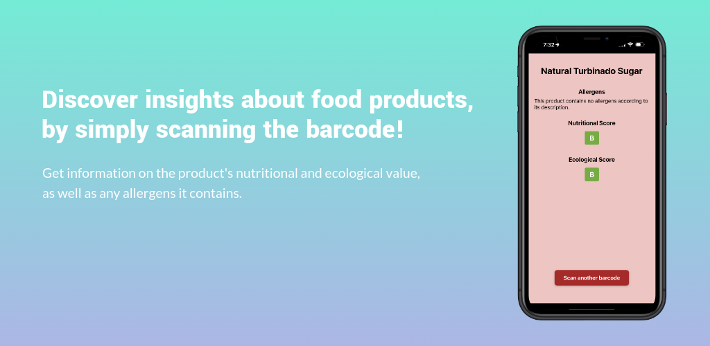
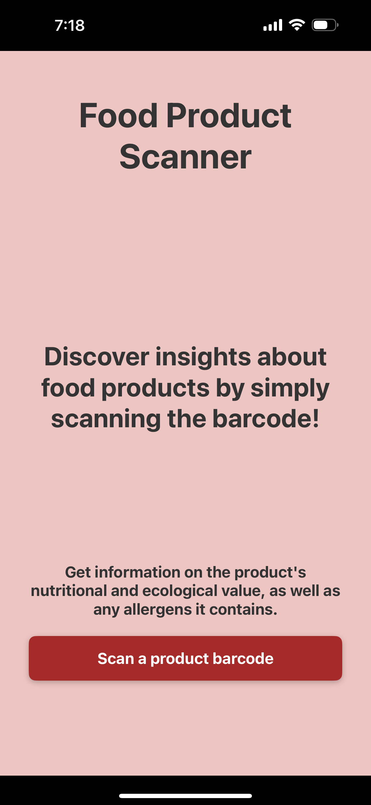
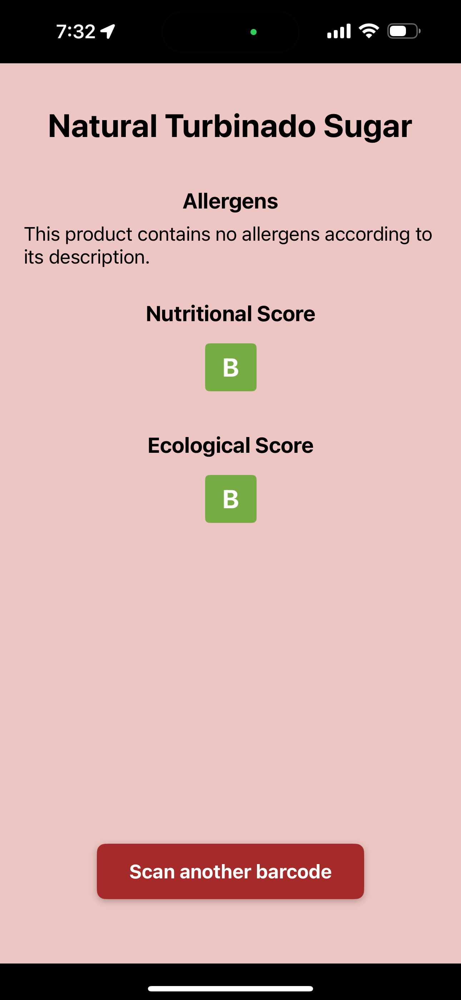

# Food Product Scanner

An app that allows the user to scan a food product's barcode and provides valuable insights about the item. Insights include nutritional score, ecological score, and possibly present allergens. Created using React Native. Information about the food products are retrieved from the Open Food Facts API.



To run the app:
```bash
# using npm
npm start
npm run ios 
npm run android

# OR using Yarn
yarn start
yarn android
yarn ios
```

<p float="center">
  
  
</p>
